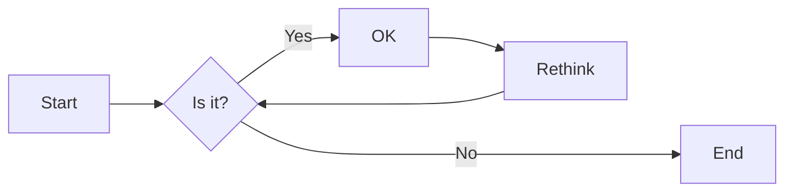

# nord-marp-theme

[Nord](https://www.nordtheme.com/) theme for [Marp](https://marp.app/).

---

# h1

## h2

### h3

#### h4

##### h5

###### h6

---

# Paragraph

Lorem ipsum dolor sit amet, consectetur adipiscing elit, sed do eiusmod tempor incididunt ut labore et dolore magna aliqua.

Ut enim ad minim veniam, quis nostrud exercitation ullamco laboris nisi ut aliquip ex ea commodo consequat.

**This is bold text.**

_This is italic text._

---

# Blockquote

> blockquote.
>
>> Nested blockquote.

---

# List

- Lorem ipsum dolor sit amet
- Consectetur adipiscing elit
  - Integer molestie lorem at massa

1. Lorem ipsum dolor sit amet
2. Consectetur adipiscing elit
3. Integer molestie lorem at massa

---

## Table

| Option | Description                     |
| ------ | ------------------------------- |
| hoge   | Lorem ipsum dolor sit amet      |
| fuga   | Consectetur adipiscing elit     |
| piyo   | Integer molestie lorem at massa |

---

# Code

This is `inline code` .

```javascript
const sayHello = (name) => {
  console.log(`Hello ${name}`.);
}

sayHello("John");
```

---

# Highlighting with [Shiki](https://shiki.style/)

```javascript
// marp.config.mjs

import { defineConfig } from "@marp-team/marp-cli";
import Shiki from "@shikijs/markdown-it";

export default defineConfig({
  engine: async ({ marp }) => {
    marp.use(await Shiki({ theme: "nord" }));

    return marp;
  },
});
```

---

# Github-style alerts

```javascript
// marp.config.mjs

import { defineConfig } from "@marp-team/marp-cli";
import MarkdownItGitHubAlerts from "markdown-it-github-alerts";

export default defineConfig({
  engine: async ({ marp }) => {
    marp.use(MarkdownItGitHubAlerts);

    return marp;
  },
});
```

---

> [!NOTE]
> Highlights information that users should take into account, even when skimming.

> [!TIP]
> Optional information to help a user be more successful.

> [!IMPORTANT]
> Crucial information necessary for users to succeed.

> [!WARNING]
> Critical content demanding immediate user attention due to potential risks.

> [!CAUTION]
> Negative potential consequences of an action.

---

# mermaid


