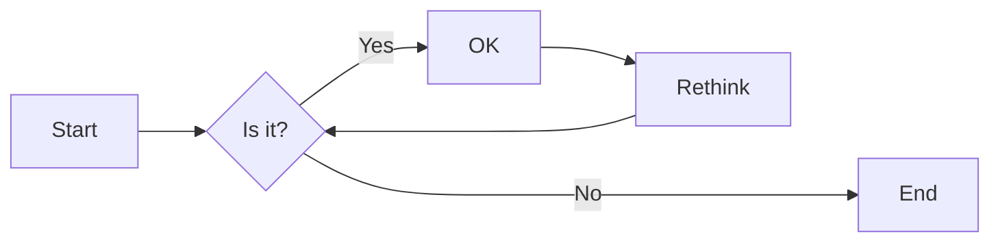
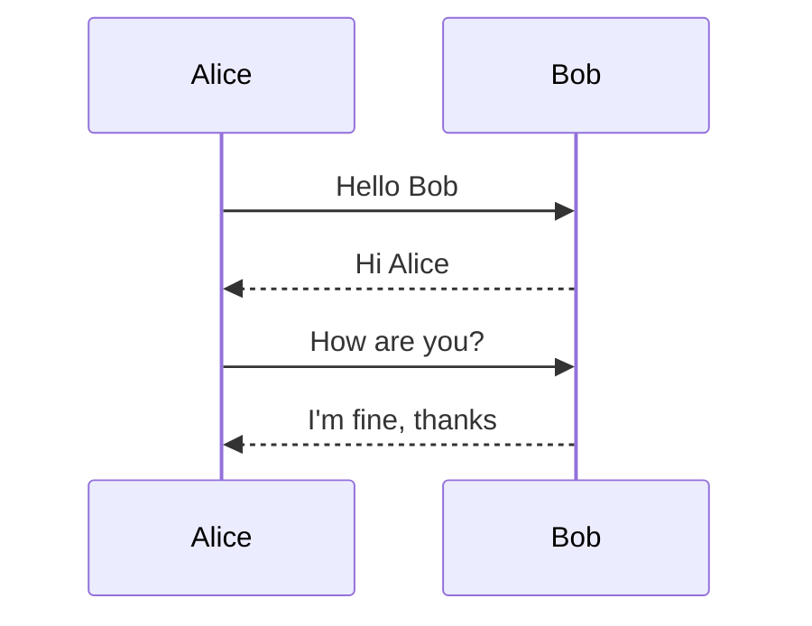
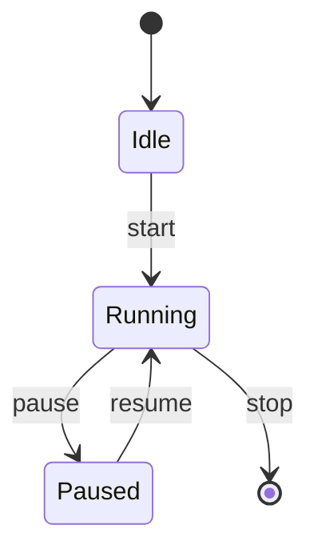
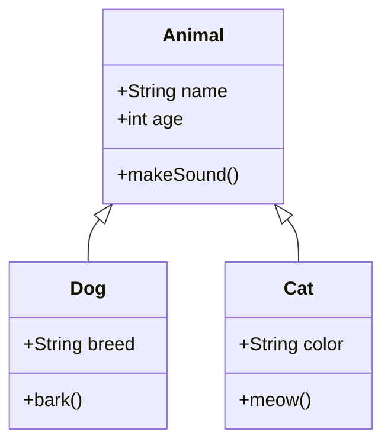

# nord-marp-theme

[Nord](https://www.nordtheme.com/) theme for [Marp](https://marp.app/).

---

# h1

## h2

### h3

#### h4

##### h5

###### h6

---

# Heading & Body

## Section heading

Body text under h2. Lorem ipsum dolor sit amet, consectetur adipiscing elit.

### Subsection heading

Body text under h3. Used to verify that the body color does not overpower h3-h6 headings on a dark background.

#### Detail heading

Body text under h4.

---

# Paragraph

Lorem ipsum dolor sit amet, consectetur adipiscing elit, sed do eiusmod tempor incididunt ut labore et dolore magna aliqua.

Ut enim ad minim veniam, quis nostrud exercitation ullamco laboris nisi ut aliquip ex ea commodo consequat.

**This is bold text.**

_This is italic text._

---

# Inline elements

A paragraph that mixes a [hyperlink](https://www.nordtheme.com/), some `inline code`, **bold**, _italic_, ~~strikethrough~~, and a keyboard shortcut <kbd>Ctrl</kbd> + <kbd>C</kbd>.

Another line: see the [Nord docs](https://www.nordtheme.com/docs) and run `deno task build` after editing the theme.

---

# Blockquote

> blockquote.
>
>> Nested blockquote.

---

# List

- Lorem ipsum dolor sit amet
- Consectetur adipiscing elit
  - Integer molestie lorem at massa

1. Lorem ipsum dolor sit amet
2. Consectetur adipiscing elit
3. Integer molestie lorem at massa

---

# Task list & horizontal rule

- [x] Completed task
- [x] Another completed item
- [ ] Pending task
- [ ] Item that is still open
  - [x] Nested completed sub-task
  - [ ] Nested pending sub-task

Content above the horizontal rule.

<hr>

Content below the horizontal rule (`<hr>`) within a single slide.

---

## Table

| Option | Description                     |
| ------ | ------------------------------- |
| hoge   | Lorem ipsum dolor sit amet      |
| fuga   | Consectetur adipiscing elit     |
| piyo   | Integer molestie lorem at massa |

---

# Image


_Generated by Gemini_

---

# Code

This is `inline code` .

```javascript
const sayHello = (name) => {
  console.log(`Hello ${name}`.);
}

sayHello("John");
```

---

# Math (KaTeX)

Inline math: $E = mc^2$ and $\sum_{i=1}^{n} i = \frac{n(n+1)}{2}$.

Display math:

$$
\int_{-\infty}^{\infty} e^{-x^2} \, dx = \sqrt{\pi}
$$

$$
A = \begin{pmatrix} a & b \\\\ c & d \end{pmatrix}
$$

---

# Highlighting with [Shiki](https://shiki.style/)

```javascript
// marp.config.mjs

import { defineConfig } from "@marp-team/marp-cli";
import Shiki from "@shikijs/markdown-it";

export default defineConfig({
  engine: async ({ marp }) => {
    marp.use(await Shiki({ theme: "nord" }));

    return marp;
  },
});
```

---

# Github-style alerts

```javascript
// marp.config.mjs

import { defineConfig } from "@marp-team/marp-cli";
import MarkdownItGitHubAlerts from "markdown-it-github-alerts";

export default defineConfig({
  engine: async ({ marp }) => {
    marp.use(MarkdownItGitHubAlerts);

    return marp;
  },
});
```

---

> [!NOTE]
> Highlights information that users should take into account, even when skimming.

> [!TIP]
> Optional information to help a user be more successful.

> [!IMPORTANT]
> Crucial information necessary for users to succeed.

---

> [!WARNING]
> Critical content demanding immediate user attention due to potential risks.

> [!CAUTION]
> Negative potential consequences of an action.

---

# Mermaid - Flowchart



---

# Mermaid - Sequence



---

# Mermaid - State



---

# Mermaid - Class


