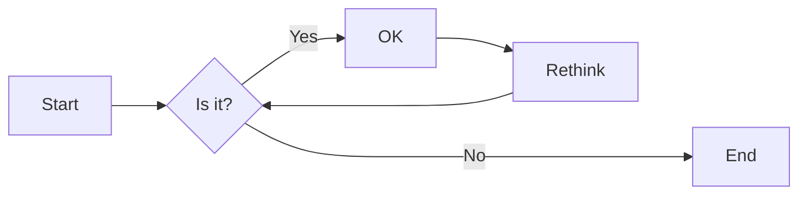
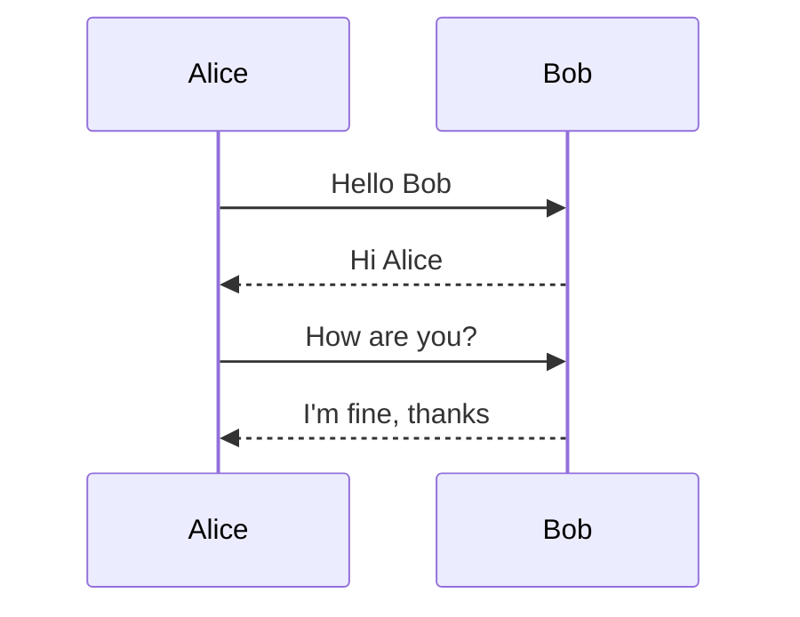
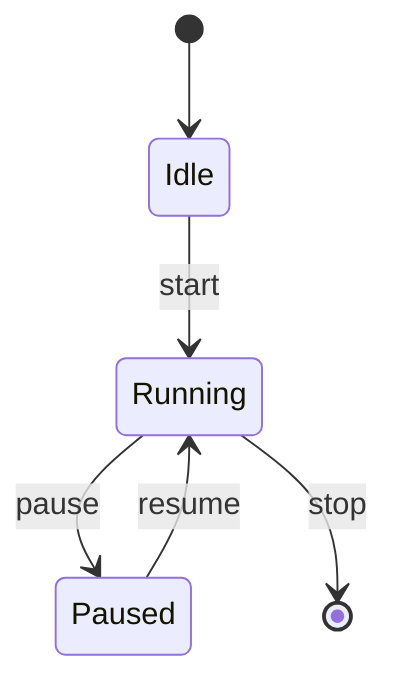
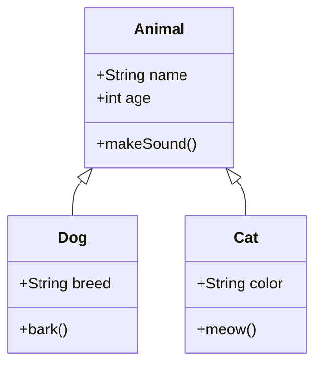

# nord-marp-theme

[Nord](https://www.nordtheme.com/) theme for [Marp](https://marp.app/).

---

# h1

## h2

### h3

#### h4

##### h5

###### h6

---

# Heading & Body (h2-h3)

## Section heading

Body text under h2. Lorem ipsum dolor sit amet, consectetur adipiscing elit.

### Subsection heading

Body text under h3. Used to verify that the body color does not overpower h3-h6 headings on a dark background.

---

# Heading & Body (h4-h6)

#### Detail heading

Body text under h4.

##### Minor heading

Body text under h5. Used to verify that h5 is still visually distinguishable from body text on a dark Nord background.

###### Smallest heading

Body text under h6. Used to verify that h6 does not become smaller than body text after dropping Marp's default theme.

---

# Paragraph

Lorem ipsum dolor sit amet, consectetur adipiscing elit, sed do eiusmod tempor incididunt ut labore et dolore magna aliqua.

Ut enim ad minim veniam, quis nostrud exercitation ullamco laboris nisi ut aliquip ex ea commodo consequat.

**This is bold text.**

_This is italic text._

---

# 日本語の自動改行処理

## バランスの取れた長い日本語の見出しで折り返しを確認するためのテストケース

日本語の文章を含むスライドでは、ブラウザのデフォルトの改行ルールで処理すると文節の途中や助詞の前後で不自然な位置に改行が入ることがある。このテーマでは `word-break: auto-phrase` を heading と paragraph に適用しており、Chromium が文節単位で改行位置を推定して自然な折り返しを実現する。

`text-wrap: balance` は heading 用に、`text-wrap: pretty` は paragraph 用に併用される。

---

# Inline elements

A paragraph that mixes a [hyperlink](https://www.nordtheme.com/), some `inline code`, **bold**, _italic_, ~~strikethrough~~, and a keyboard shortcut <kbd>Ctrl</kbd> + <kbd>C</kbd>.

Another line: see the [Nord docs](https://www.nordtheme.com/docs) and run `deno task build` after editing the theme.

---

# Footnote (slide 1)

A paragraph with a footnote reference[^1]. Multiple footnotes[^2] can be placed in the same paragraph.

Longer labels[^longer-label] are also supported, so verify that reference markers function as links.

[^1]: First footnote on slide 1. The `a.footnote-backref` arrow links back to the reference.

[^2]: Second footnote on slide 1.

[^longer-label]: Long labels are renumbered in the rendered list.

---

# Footnote (slide 2)

A separate slide can define its own footnotes[^slide2-a] independently.

Across multiple slides, each slide's footnotes stay scoped[^slide2-b] to that slide.

[^slide2-a]: Footnote on slide 2. Does not mix with footnotes from slide 1.

[^slide2-b]: Second footnote on slide 2. Demonstrates per-slide isolation.

---

# Blockquote

> blockquote.
>
>> Nested blockquote.

---

# List

- Lorem ipsum dolor sit amet
- Consectetur adipiscing elit
  - Integer molestie lorem at massa

1. Lorem ipsum dolor sit amet
2. Consectetur adipiscing elit
3. Integer molestie lorem at massa

---

# Task list & horizontal rule

- [x] Completed task
- [x] Another completed item
- [ ] Pending task
- [ ] Item that is still open
  - [x] Nested completed sub-task
  - [ ] Nested pending sub-task

Content above the horizontal rule.

<hr>

Content below the horizontal rule (`<hr>`) within a single slide.

---

## Table

| Option | Description                     |
| ------ | ------------------------------- |
| hoge   | Lorem ipsum dolor sit amet      |
| fuga   | Consectetur adipiscing elit     |
| piyo   | Integer molestie lorem at massa |

---

# Image


_Generated by Gemini_

---

# Code

This is `inline code` .

```javascript
const sayHello = (name) => {
  console.log(`Hello ${name}`.);
}

sayHello("John");
```

---

# Math (KaTeX)

Inline math: $E = mc^2$ and $\sum_{i=1}^{n} i = \frac{n(n+1)}{2}$.

Display math:

$$
\int_{-\infty}^{\infty} e^{-x^2} \, dx = \sqrt{\pi}
$$

$$
A = \begin{pmatrix} a & b \\\\ c & d \end{pmatrix}
$$

---

# Highlighting with [Shiki](https://shiki.style/)

```javascript
// marp.config.mjs

import { defineConfig } from "@marp-team/marp-cli";
import Shiki from "@shikijs/markdown-it";

export default defineConfig({
  engine: async ({ marp }) => {
    marp.use(await Shiki({ theme: "nord" }));

    return marp;
  },
});
```

---

# Shiki: line highlight (`{N,M-K}`)

Write line numbers like `{2,4-5}` after the language tag in a fence to apply the `.highlighted` class to those lines (`transformerMetaHighlight`).

```javascript {2,4-5}
const a = 1;
const b = 2; // this line is highlighted
const c = 3;
const d = 4; // from here
const e = 5; // ...to here
```

---

# Shiki: word highlight (`/word/`)

Write a word like `/sayHello/` after the language tag in a fence to wrap every occurrence in `.highlighted-word` (`transformerMetaWordHighlight`).

```javascript /sayHello/
const sayHello = (name) => {
  console.log(`Hello ${name}`);
};

sayHello("John");
```

---

# Shiki: line focus (`[!code focus]`)

Add a `// [!code focus]` comment in the code to mark that line with `.focused`; the rest of the lines are dimmed via the `.has-focused` decoration (opacity + blur). (`transformerNotationFocus`)

```javascript
const a = 1;
const b = 2;
const c = a + b; // [!code focus]
console.log(c);
```

---

# Github-style alerts

```javascript
// marp.config.mjs

import { defineConfig } from "@marp-team/marp-cli";
import MarkdownItGitHubAlerts from "markdown-it-github-alerts";

export default defineConfig({
  engine: async ({ marp }) => {
    marp.use(MarkdownItGitHubAlerts);

    return marp;
  },
});
```

---

> [!NOTE]
> Highlights information that users should take into account, even when skimming.

> [!TIP]
> Optional information to help a user be more successful.

> [!IMPORTANT]
> Crucial information necessary for users to succeed.

---

> [!WARNING]
> Critical content demanding immediate user attention due to potential risks.

> [!CAUTION]
> Negative potential consequences of an action.

---

# Mermaid - Flowchart



---

# Mermaid - Sequence



---

# Mermaid - State



---

# Mermaid - Class


